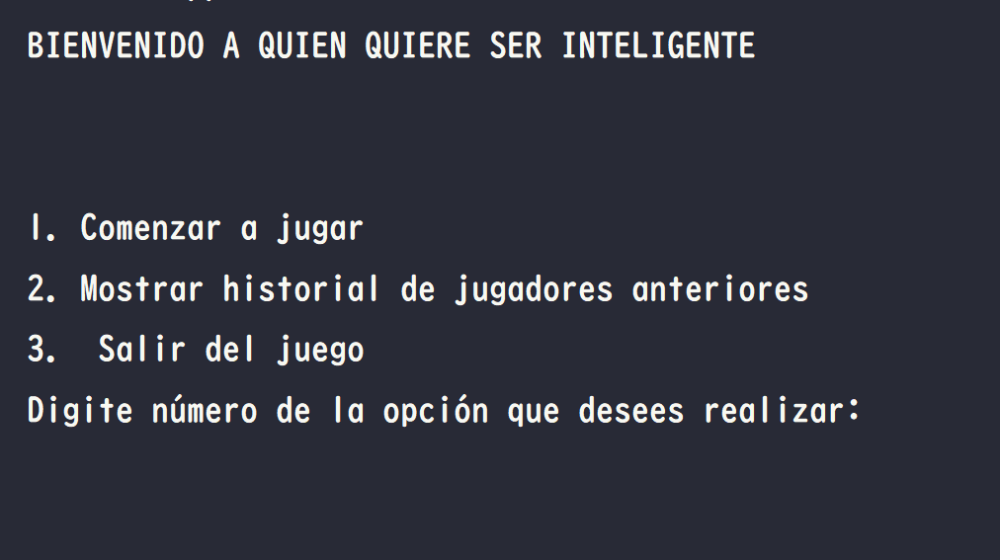
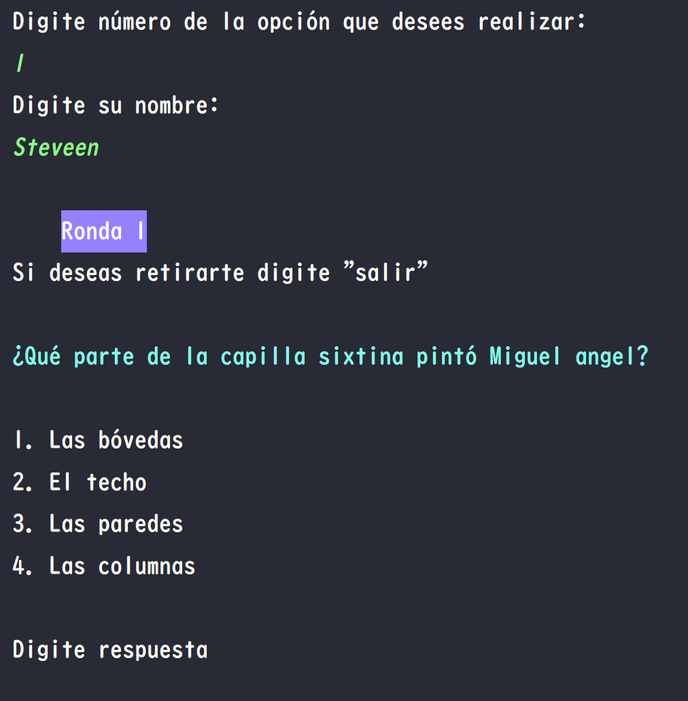

# Bienvenidos a Quién quiere ser inteligente?

### Este es un juego de preguntas y respuestas con dificultad en cinco niveles.

### El juego es realizado en el lenguaje de programación Java y el paradigma de la programación orientado a objetos

### El juego inicia preguntadole al usuario que acción desea realizar, una vez, escogidfa la acción podrá ingresar el nombre y seguidamente comenzará el juego en el primer nivel de dificulta mostrando la pregunta número uno.

### Imagenes

